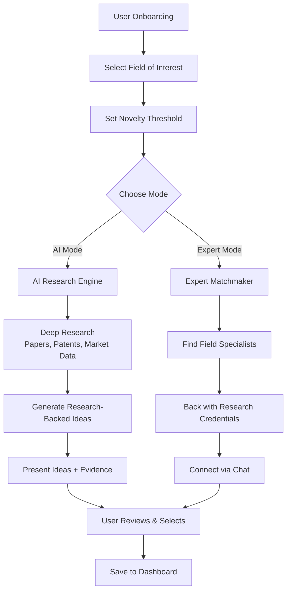

# Le Sage AI — Research-Backed Startup Idea Engine & Expert Matchmaker

> **"Don't just generate ideas — validate them with research and connect with the minds that can make them real."**
> 

---

## Project Overview

**Le Sage AI** is an AI-powered platform that goes beyond simple startup idea generation. It combines **deep research automation**, **novelty-based idea curation**, and **expert matchmaking** into a single intelligent system — helping aspiring entrepreneurs move from *"What should I build?"* to *"Here's what you should build, why it works, and who can help."*

### Core Value Proposition

| **Capability** | **Description** |
| --- | --- |
| Research-Backed Idea Generation | Provides startup ideas grounded in the latest academic and industry research in the user's chosen field |
| AI Automation Engine | Automates extensive research on market novelty, competition, and feasibility for each startup idea |
| Dual-Mode Ideation | Users choose between AI-generated ideas *or* connecting with field-specific human experts |
| Expert Matchmaking | Recommends verified specialists backed by research credentials, with built-in chat for collaboration |

---

## Competitive Landscape Analysis

After extensive research, several platforms exist in adjacent spaces, but **none fully combine all three pillars** — research-backed ideation, AI automation, and expert matchmaking — into one cohesive product.

### Existing Platforms & Gaps

| **Platform** | **What It Does** | **Gap / Missing Feature** |
| --- | --- | --- |
| **IdeaProof** | AI startup idea generator + market validation in 120 seconds | No deep research automation; no expert matching |
| [**Stratup.ai**](http://Stratup.ai) | AI-powered idea generation with a database of 80,000+ ideas | No research backing; no expert connection; ideas lack novelty scoring |
| **Buildpad** | AI idea generation + social media validation via web search | Limited to social proof; no academic research; no expert matching |
| **ValidatorAI / DimeADozen** | AI-driven idea validation with market and competitor analysis | Validation only — doesn't *generate* ideas or connect users with experts |
| **CoFoundersLab / YC Co-Founder Matching** | Cofounder and advisor matching for startups | No AI research engine; matching is people-only without research context |
| **IdeasGPT** | AI business idea generator with market analysis | No novelty-based research depth; no expert recommendation |

### Opportunity Gap — What Makes Le Sage AI Unique

<aside>

**No existing platform combines:**

1. **Research-depth** — pulling from academic papers, industry reports, and patent databases
2. **Novelty-based automation** — letting the user define the novelty threshold and automating deep research accordingly
3. **Dual-mode ideation** — AI-generated ideas *or* expert-recommended ideas
4. **Expert matchmaking with research context** — connecting users with specialists *alongside* the research that backs up the recommendation

This is a **clear whitespace opportunity** in the market.

</aside>

---

## System Architecture & Flow

### Key Application Flows

- **Flow 1: AI-Powered Idea Generation**
    1. User selects a field of interest (e.g., *HealthTech, FinTech, EdTech*)
    2. User sets a **novelty level** (Low → incremental improvements, High → breakthrough innovation)
    3. AI engine conducts deep research — scanning academic databases, patent filings, market reports, and trend data
    4. Engine generates startup ideas ranked by **feasibility, novelty, and market potential**
    5. Each idea is presented with supporting research citations and a confidence score
- **Flow 2: Expert Matchmaking**
    1. Instead of (or alongside) AI-generated ideas, the user opts for **expert recommendations**
    2. The system identifies specialists in the selected field — researchers, industry veterans, serial entrepreneurs
    3. Each expert profile is backed by **research credentials, publications, and domain authority scores**
    4. User can initiate a **real-time chat** with interested experts
    5. Experts can also propose ideas to the user based on the novelty parameters set

---

## Recommended Tech Stack

The following stack is optimized for **cost-effectiveness** (free tiers or open-source), **performance**, and **scalability**. Each choice is the best-in-class for its specific role.

### Frontend

| **Component** | **Technology** | **Why This Choice** | **Cost** |
| --- | --- | --- | --- |
| Framework | **Next.js 15** (React) | SSR + SSG for SEO, App Router, Server Actions, massive ecosystem | Free & open source |
| Styling | **Tailwind CSS**  • **shadcn/ui** | Utility-first CSS with beautiful, accessible, pre-built components | Free & open source |
| State Management | **Zustand** | Lightweight, minimal boilerplate, perfect for mid-scale apps | Free & open source |
| Real-time Chat | [**Socket.io**](http://Socket.io) | Industry-standard WebSocket library for expert chat feature | Free & open source |

### Backend & API

| **Component** | **Technology** | **Why This Choice** | **Cost** |
| --- | --- | --- | --- |
| API Server | **Python FastAPI** | Async-native, blazing fast, ideal for AI/ML workloads and streaming | Free & open source |
| Task Queue | **Celery**  • **Redis** | Handles long-running research jobs asynchronously | Free (Upstash Redis free tier) |
| Authentication | **Supabase Auth** | Full auth system with OAuth, magic links, and row-level security | Free tier (50K MAUs) |

### AI & Research Engine

| **Component** | **Technology** | **Why This Choice** | **Cost** |
| --- | --- | --- | --- |
| LLM (Primary) | **Groq** (Llama 3.1 / Mixtral) | Ultra-fast inference, generous free tier, great for research summarization | Free tier available |
| LLM (Fallback) | **Ollama** (local Mistral / Llama) | Run models locally for zero-cost inference during development | Completely free |
| Agent Orchestration | **LangChain**  • **CrewAI** | Multi-agent research workflows — one agent searches, one analyzes, one synthesizes | Free & open source |
| Web Research | **SearXNG** (self-hosted) + **Tavily API** | SearXNG for free meta-search; Tavily for structured AI-optimized search | SearXNG free; Tavily free tier |
| Academic Research | **Semantic Scholar API**  • **arXiv API** | Access millions of academic papers with semantic search capability | Both completely free |

### Database & Storage

| **Component** | **Technology** | **Why This Choice** | **Cost** |
| --- | --- | --- | --- |
| Primary Database | **Supabase** (PostgreSQL) | Managed Postgres with realtime subscriptions, REST API, and generous free tier | Free tier (500MB, 50K MAUs) |
| Vector Database | **ChromaDB** | Open-source, lightweight, purpose-built for AI embeddings and semantic search | Free & open source |
| Caching | **Upstash Redis** | Serverless Redis with pay-per-request and a generous free tier | Free tier (10K commands/day) |

### Deployment & Infrastructure

| **Component** | **Technology** | **Why This Choice** | **Cost** |
| --- | --- | --- | --- |
| Frontend Hosting | **Vercel** | Native Next.js support, edge functions, automatic CI/CD | Free tier (hobby) |
| Backend Hosting | **Railway** or [**Fly.io**](http://Fly.io) | Easy container deployment with free tiers for Python services | Free tier available |
| Containerization | **Docker** | Consistent environments across dev and prod | Free & open source |
| Monitoring | **Langfuse** | Open-source LLM observability — trace AI agent behavior and costs | Free & open source |

### Estimated Total Cost at MVP Stage

<aside>

**$0/month** — Every component in the recommended stack has a free tier or is fully open source. You can build, launch, and validate your MVP at **zero cost**, scaling to paid tiers only when traction demands it.

</aside>

---

## Feature Roadmap

### Phase 1 — MVP (Months 1–3)

- [ ]  User onboarding flow with field-of-interest selection
- [ ]  AI research engine (Semantic Scholar + arXiv + web search)
- [ ]  Basic startup idea generation with research citations
- [ ]  User dashboard to save and manage ideas
- [ ]  Authentication and user profiles

### Phase 2 — Core Platform (Months 3–5)

- [ ]  Novelty threshold slider and scoring algorithm
- [ ]  Expert profile database with credential verification
- [ ]  Expert matchmaking engine based on field + novelty
- [ ]  Real-time chat system between users and experts
- [ ]  Research report PDF export

### Phase 3 — Growth & Intelligence (Months 5–8)

- [ ]  Patent database integration for deeper novelty analysis
- [ ]  Community features — upvote ideas, public idea boards
- [ ]  AI-generated pitch deck drafts based on selected ideas
- [ ]  Expert rating and review system
- [ ]  Mobile-responsive PWA

---

## Key Differentiators

<aside>

**Research-First Approach**

Unlike competitors that generate generic ideas, every Le Sage suggestion is backed by real academic papers, patents, and market data.

</aside>

<aside>

**Novelty Control**

Users define how innovative they want to be — from incremental improvements to moonshot ideas — and the AI calibrates accordingly.

</aside>

<aside>

**Human + AI Hybrid**

The dual-mode approach (AI ideas vs. expert ideas) respects that some of the best startup advice comes from humans, not just algorithms.

</aside>

---

## References & Research Sources

- **Semantic Scholar API** — Access to 200M+ academic papers with AI-powered search
- [**arXiv.org**](http://arXiv.org) — Open-access preprints across all scientific fields
- **Buildpad** — Existing tool combining AI idea gen + social media validation
- **IdeaProof** — AI startup idea generator with market validation
- **Y Combinator Co-Founder Matching** — Existing expert/cofounder matching model
- **CoFoundersLab** — Community-driven founder and advisor matching
- **CrewAI Documentation** — Multi-agent orchestration framework
- **LangChain Documentation** — LLM application framework

---

*Last updated: February 15, 2026*

---

<aside>

**Note:** The current project flow is just a base version and is subjected to changes in the future when exploring new options. This also applies to addressing different types of use cases and isolating user types.

</aside>